<p align="center">
  
</p>

<p align="center">
  <a href="README.es.md">Español</a> ·
  <a href="README.fr.md">Français</a> ·
  <a href="README.ja.md">日本語</a> ·
  <a href="README.de.md">Deutsch</a> ·
  <a href="README.pl.md">Polski</a> ·
  <a href="README.pt.md">Português</a> ·
  <a href="README.nl.md">Nederlands</a> ·
  <a href="README.it.md">Italiano</a> ·
  <a href="README.ru.md">Русский</a>
</p>

# HAIR

***HAIR moves your IR codes out of vendor clouds, blaster memory, and config files, and into Home Assistant itself.*** Point any remote at an IR receiver, press a button, and HAIR turns that signal into a native HA entity. A button you can fire from any dashboard. An event that ***triggers automations***. A command broadcast through any blaster on HA's native `infrared` platform, whether that is an ESPHome IR LED, a [Tuya Local](https://github.com/make-all/tuya-local) IR blaster, a Broadlink RM, an SMLIGHT SLZB, or anything else that adopts the platform.

No vendor cloud, no YAML, nothing learned into somebody else's box -- just point, press, use. Prefer a head start? Drop code files onto the Closet -- shared wigs, SmartIR JSON, Flipper Zero `.ir`, LIRC configs, Girr exports -- or let the optional manufacturer and model picker in the Clipper pre-fill a remote from your installed code library.

> [!IMPORTANT]
> **HAIR speaks ten languages, and eight of them need your help.** Spanish got its native-speaker review (thanks @Waterbrain). The French, Japanese, German, Polish, Portuguese, Dutch, Italian, and Russian translations were drafted by a programming assistant and are marked "reviewer wanted" inside each dictionary file. If you use Home Assistant in one of these languages, a native-speaker pass over one file is all it takes, and your name goes in the file as its reviewer. A language we don't have yet is a two-file PR. Start here: [Adding a language](CONTRIBUTING.md#adding-a-language).
>
> <details><summary>See the panel translated -- the same device detail in Spanish, the one translation with a native-speaker review</summary>
>
> 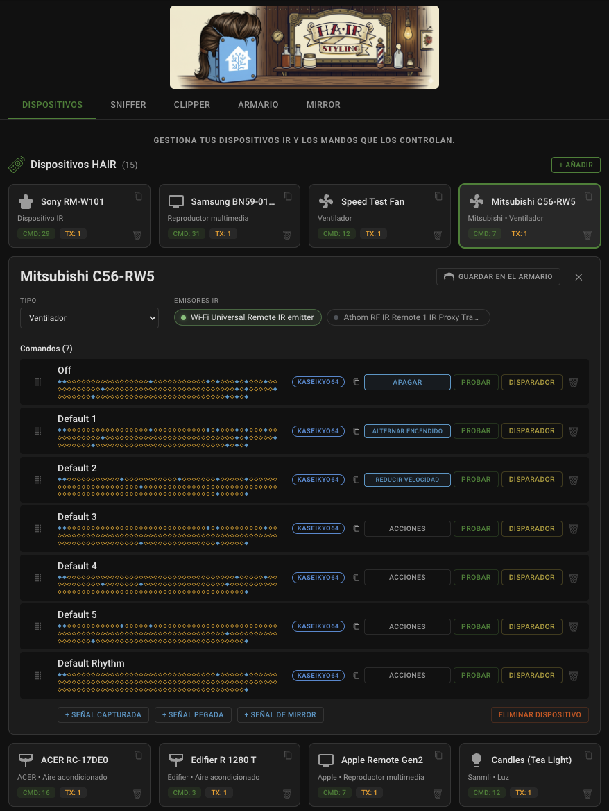
>
> </details>

## Installation

### HACS (Recommended)

[](https://my.home-assistant.io/redirect/hacs_repository/?owner=DAB-LABS&repository=HAIR&category=integration)

Click the button above, then **Download**, then restart Home Assistant.

Or find it by hand:

1. Open **HACS** in your Home Assistant sidebar
2. Search for **HAIR**
3. Click it, then **Download**
4. Restart Home Assistant

### Manual

1. Copy `custom_components/hair` into your HA `custom_components/` directory
2. Restart Home Assistant

## Setup

1. Go to **Settings > Devices & Services**
2. Click **Add Integration** and search for "HAIR"
3. The config flow auto-detects your IR hardware (emitters and receivers)
4. Once added, find **HAIR** in the sidebar

## Requirements

- Home Assistant **2026.4** or later; **2026.6+ recommended** for native IR receivers
- **For capture (RX):** any integration that exposes HA's native `InfraredReceiverEntity` -- ESPHome IR receivers work day-one, SMLIGHT Ultima receivers work natively since HA 2026.7, and any other integration that adopts the receiver entity works automatically.
- **For send (TX):** at least one integration on HA's native infrared platform (ESPHome infrared entities, [Tuya Local](https://github.com/make-all/tuya-local) IR blasters, Broadlink RM series, SMLIGHT SLZB devices, etc.)

## Platform state

Home Assistant's native `infrared` platform shipped transmit (TX) support in HA 2026.4 and receive (RX) support via `InfraredReceiverEntity` in HA 2026.6.

### Infrared platform compatibility

HAIR works with any integration that exposes HA's native `infrared` entity platform. These integrations have adopted it:

| Integration | Source | TX | RX | Pluck | Status |
|---|---|---|---|---|---|
| [ESPHome](https://esphome.io/) | Core | Yes | Yes | No | Since 2026.4 (TX), 2026.6 (native RX) |
| [Tuya Local](https://github.com/make-all/tuya-local) | HACS | Yes | No | Yes | TX since 2026.4, Pluck since 2026.6.2 |
| [Broadlink](https://www.home-assistant.io/integrations/broadlink/) | Core | Yes | No | No | Since 2026.5 |
| [SMLIGHT](https://www.home-assistant.io/integrations/smlight/) | Core | Yes | Yes | No | TX since 2026.5, native RX (Ultima) since 2026.7 |

On HA 2026.6+, HAIR subscribes to native `InfraredReceiverEntity` instances via `infrared.async_subscribe_receiver()`. Any integration that implements the receiver entity works as a HAIR receiver automatically.

As more integrations adopt the `infrared` platform, HAIR picks them up with no changes needed on HAIR's side.

Some integrations go a step further and let HAIR pull codes already learned into their own blasters out of the vendor silo and into Home Assistant. [Tuya Local](https://github.com/make-all/tuya-local) is the first to support this. See [The Plucker Tab](#the-plucker-tab) for how it works, and [Making your integration pluckable](docs/making-your-integration-pluckable.md) if you maintain an integration and want to add support.

## Screenshots

| Devices Overview | Device Detail |
|:---:|:---:|
| 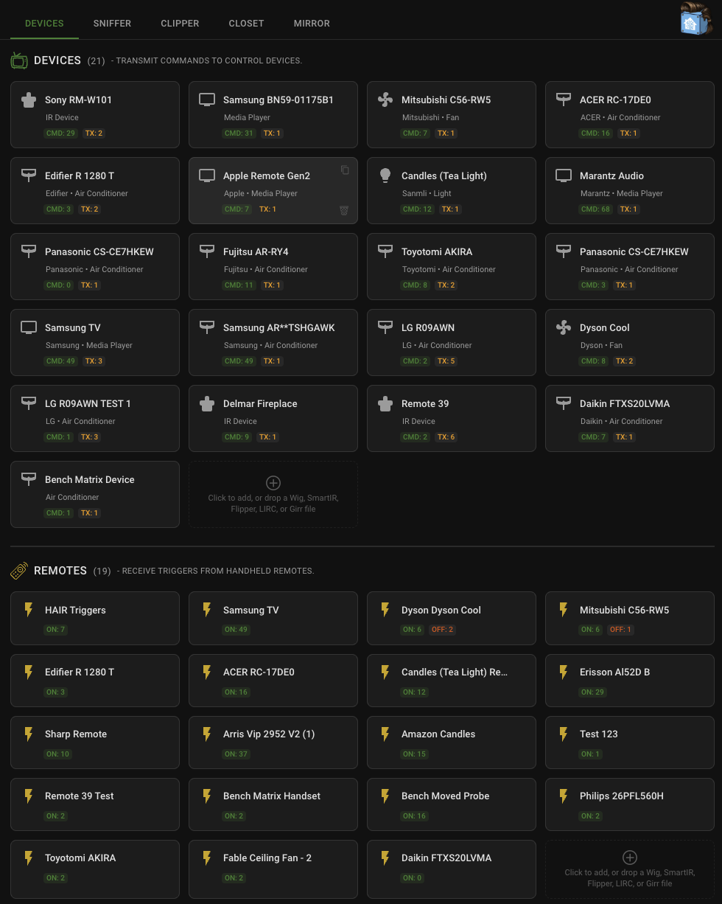 | 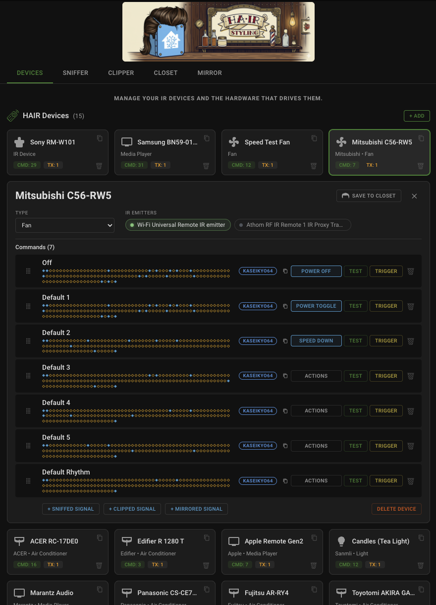 |

Every tab and dialog is pictured beside its own section in [Using HAIR](#using-hair).

## Features

The short tour. Each entry links to its full story in [Using HAIR](#using-hair).

- **[The Sniffer](#the-sniffer-tab)** -- a passive listener that captures every signal your receivers hear, fingerprints it, deduplicates repeat presses, and groups it by source remote, live. Test any capture through an emitter before you commit it to a device.
- **[The Clipper](#the-clipper-tab)** -- build remotes by hand by pasting Pronto hex codes, validated as you type, for the codes you have on paper but not in the air. An optional picker pre-fills a remote from your installed code library by manufacturer and model.
- **[The Plucker](#the-plucker-tab)** -- pull codes already learned into a vendor blaster ([Tuya Local](https://github.com/make-all/tuya-local) first) into HAIR by name, with nothing broadcast over the air.
- **[The Mirror](#the-mirror-tab)** -- the send audit: every IR command Home Assistant transmits, which emitter carried it, and whether a receiver heard it back -- which is how you find a dead IR LED without pointing a phone camera at it. Also the third road for importing codes.
- **[The Closet](#the-closet-tab)** -- portable code sets called wigs, one JSON file per remote, plus an import funnel that converts SmartIR, Flipper Zero, LIRC, and Girr files on drop. HAIR ships zero codes; the closet holds what you capture, convert, or collect.
- **[Fittings](#fitting-a-wig)** -- prove a wig on real hardware and the proof travels in the file: signed per-command claims, honest exclusions, and a download filename that says what the wig has earned.
- **[Combing](#combing-a-wig)** -- arithmetic defect checks on every arriving wig: no hardware, no decoder, and it catches the broken code before you build a device on it.
- **[Stateful air conditioners](#stateful-air-conditioners)** -- a SmartIR climate file becomes a fully-controlled climate entity driven by its state matrix, with nothing to map by hand.
- **[Triggers](#triggers)** -- any IR press becomes a native HA event entity with a min-hits guard, so a physical remote can drive your automations.
- **[Devices and entities](#the-devices-tab)** -- typed device profiles with native HA entities to match ([the table](#entity-platforms)), [action mapping](#action-mapping) that keeps entity features honest, one-click duplication, and drag-to-reorder that sticks, everywhere.
- **[The editor](#editing-signals-and-commands)** -- open any signal or command: live Pronto validation, protocol recognition, one-click carrier snap, per-command send counts, and renames that action mappings follow. Aliases name a signal without naming a command.
- **Emitter routing** -- assign one or more emitters per device: pin an AC to the bedroom blaster so commands never leak next door, or broadcast TV Power through every room at once. Configured per device, so tight targeting and whole-house broadcast mix freely.
- **Native receiver support** -- HAIR subscribes to HA's native `InfraredReceiverEntity` (2026.6+), so any integration that adopts the receiver entity works automatically; `RX-NATIVE` and `RX-BRIDGE` badges on the Devices tab show which receive path each piece of hardware is using.
- **Ten languages** -- the panel and setup wizard follow your HA profile language (English, Spanish, French, Japanese, German, Polish, Portuguese, Dutch, Italian, Russian). Eight translations still want a native-speaker review; see [Adding a language](CONTRIBUTING.md#adding-a-language).
- **Mobile navigation** -- a back-to-sidebar button on phone and tablet viewports, hidden on desktop.

## Using HAIR

### The Devices Tab

The main view shows up to six sections (the Blasters section appears only when a pluckable blaster is configured):

**HAIR Devices** - Your managed IR device profiles. Each card shows the device name, type, command count, and how many emitters are assigned. Drag a card to reorder your devices; the order persists. Hover over the device name and click it to rename the device inline; the change saves automatically. Each card also carries two small corner actions: a duplicate icon in the top-right to clone the device with all its commands and emitter assignments preserved, and a delete icon in the bottom-right for removing the device without opening its detail view. Click anywhere else on the card to expand its detail view inline, where you can change the device type, manage emitters, drag-to-reorder commands, and see every learned command with its S/L diamond fingerprint pattern. From the detail view you can test commands, delete them, assign action mappings, or replace a command's code in place: paste a new Pronto, or press LISTEN and capture it off the real remote. **Save to Closet** in the header turns the device into a shareable wig file; see [The Closet Tab](#the-closet-tab) and [Fitting a wig](#fitting-a-wig).

**Triggers** - Active IR triggers that fire HA event entities when their signal is detected. Each trigger card shows the trigger name with a lightning bolt icon. When a trigger fires, the card flashes with an amber glow animation in real time.

**Emitters** - Your IR transmitter hardware (e.g., ESPHome infrared entities, Tuya Local IR blasters, Broadlink RM series, SMLIGHT SLZB devices). These are the physical IR LEDs that send commands. Each emitter card shows its entity ID and a TX badge, plus a `TX-NATIVE` badge once the device exposes the transmitter on HA's native infrared platform.

**Receivers** - Your IR receiver hardware. These feed captured signals into the Sniffer. Each receiver card shows its source integration, its entity ID, and one of two RX badges. `RX-NATIVE` means the device is exposing the receiver via HA's native `InfraredReceiverEntity` (HA 2026.6+) and HAIR is subscribing through the official API. `RX-BRIDGE` means HAIR is consuming `esphome.remote_received` events from the legacy event-bus bridge. Both work; the badge tells you which path is active. Devices on the bridge path that also have a native receiver registered will show both badges side by side during the migration window.

**Proxies** - Hardware devices that have both TX and RX capabilities. A single ESPHome board with an IR LED and an IR receiver shows up here with TX and RX badges plus their NATIVE / BRIDGE state, so you can see the full migration picture for that device in one card.

**Blasters (Pluckable)** - Vendor IR blasters that HAIR can pull already-learned codes from. This section shows only when you have a compatible blaster configured. Each card carries the blaster and appliance name and an "Open in Plucker" action that jumps to the Plucker tab so you can pluck its codes. See [The Plucker Tab](#the-plucker-tab).

### The Sniffer Tab

The Sniffer is a passive listener that shows every IR signal your receivers pick up. Signals are grouped by source device (identified by carrier frequency and preamble fingerprint) and displayed with hit counts, signal counts, and last-seen timestamps.

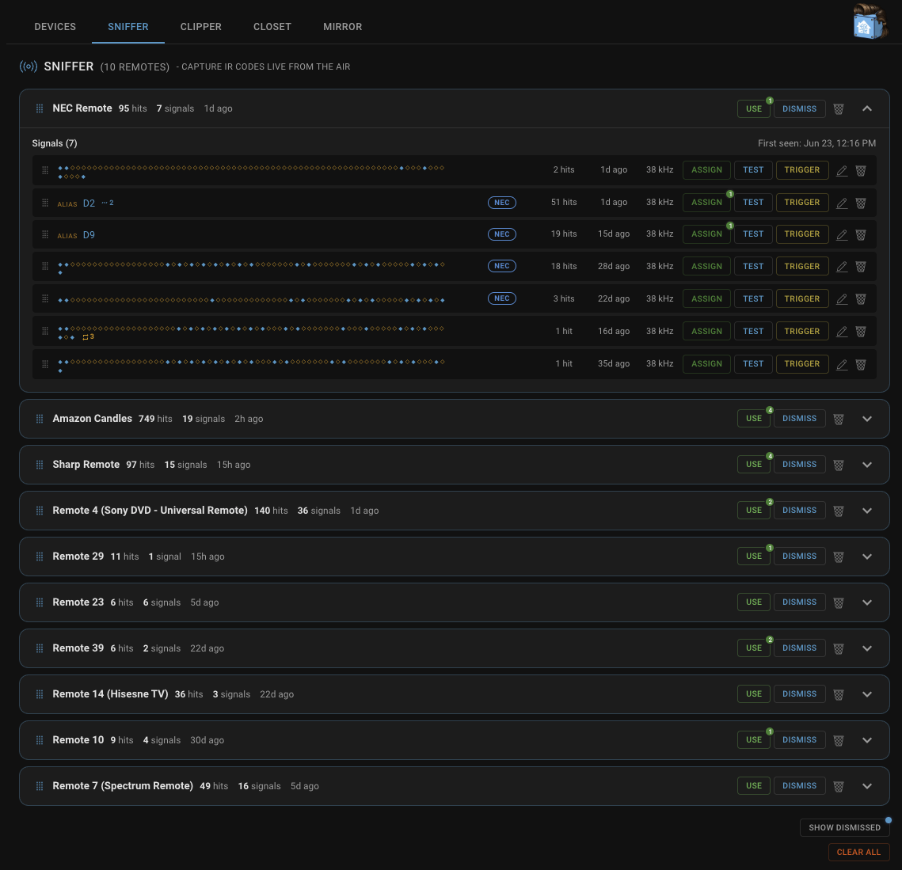

Each source device row can be expanded to show individual signals with their S/L diamond fingerprint. From here you can assign a signal directly to a HAIR device as a named command, or promote an unknown source device into a full HAIR device profile. Before promoting, hover over the source device's name on the row and click it to rename it -- otherwise the new device inherits the auto-generated source name (e.g., "Unknown Remote 1"). Renaming first lands the promoted device in your Devices tab already labeled correctly, though you can also rename it later from the Devices tab if you prefer to promote first.

The Test button on any captured signal opens an emitter picker so you can choose which IR emitter to fire the test signal through, and broadcast through multiple emitters at once if you want. The picker remembers your selection for the session so subsequent Tests skip straight to Send.

A remote whose codes already run a HAIR device shows a numbered dot on its ADOPT button; click through to see those devices, jump to any of them, or adopt another copy for a second room.

<p align="center">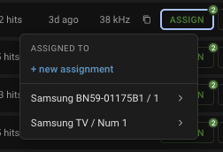</p>

You can dismiss noisy sources (like a neighbor's remote leaking through a window) and bring them back later with the "Show Dismissed" toggle (hover tooltip: "Restore previously hidden remotes"). When dismissed remotes are still firing in the background, the button quietly glows blue and shows a small dot indicator, so you can tell at a glance that there is still activity arriving from remotes you have hidden, without re-exposing those signals in the live feed. Clicking the button clears the dot and reveals the dismissed remotes so you can restore the ones you actually want back.

You can give any signal an alias by clicking its diamond pattern and typing a name. The alias replaces the diamonds in the row, which makes it easy to tell signals apart before you assign them. Assigning a signal no longer removes it from the Sniffer either. The signal is copied into the device and stays in the list, so you can assign the same signal to several devices, or as several commands, and reuse it later -- and an assigned button keeps flashing its row when you press it, so you can always see that the remote is alive.

The whole-remote actions sit in the card header: ADOPT, DISMISS, and a bare DELETE, delete last; a dismissed row carries a lone RESTORE instead. To share a sniffed remote as a wig, ADOPT it into a device and use Save to Closet there. Delete on a remote (or on a single signal row) clears it, but anything a receiver hears again comes right back -- Dismiss is the tool for keeping a remote hidden. Clear All, at the tab level, empties the list the same come-back-when-heard way.

Remotes and signals are yours to arrange. Drag the grip handle on a remote to reorder your remotes, and drag the grip on a signal row to reorder the signals inside a remote. The order you set is remembered, and a newly seen remote or signal appears at the top until you move it.

### The Clipper Tab

The Clipper tab is for building remotes by hand, for when you cannot or do not want to sniff them live. Instead of pointing a remote at a receiver, you paste a Pronto hex code for each button.

Click "+ Add" to make a named remote, then expand it and click "+ Add Signal" to add a signal. Paste the Pronto code into the dialog. As you paste, HAIR validates the code and shows a green or red check, the detected carrier frequency, the burst pair count, and the same S/L diamond fingerprint you see in the Sniffer, along with a specific message if anything is wrong (a header that is not `0000`, a truncated code, non-hex characters, or an unusual carrier frequency). Press Enter or click Create once it validates, and give it an alias up front if you like. Pasting a code that is already on the remote is refused, so a remote never ends up with two identical signals.

From there a clipped signal is identical to a sniffed one. Test it through an emitter, create a trigger from it, assign it to an existing HAIR device, or promote the whole remote into a new device. Clipped remotes are never aged out automatically, so anything you build here stays until you delete it. Drag the grip handle on a remote to reorder your remotes, and drag the grip on a signal row to reorder the signals inside a remote. Hover over a remote name to rename it inline, and click an existing signal alias to rename or clear it. The whole-remote actions sit in the card header next to ADOPT: a Delete that removes the remote and all of its signals in one step. To share a clipped remote as a wig, ADOPT it into a device and use Save to Closet there.

Pronto is the only paste format. Raw timings, Broadlink base64, and protocol-plus-command entry are not supported.

You do not always have to paste. The code-set road onto the Clipper runs through the Closet: that is where the codebooks from Home Assistant's core infrared code library and your own wig files hang, and CLIP on any entry lands it here as a working remote, one signal per button, each named for its function and decoded fresh against your install's decoders. Anything the closet does not hold is still a paste away. See [The Closet Tab](#the-closet-tab).

### The Plucker Tab

The Plucker tab pulls IR codes off a vendor blaster that already has them learned, so you do not have to re-learn each button at a receiver. It appears only when you have a compatible blaster configured, meaning one whose integration can replay a stored code by name through a chosen emitter (such as a [Tuya Local](https://github.com/make-all/tuya-local) IR blaster).

Click "+ Add Blaster" to register one: pick the vendor entity, then enter the appliance name you used when you learned the codes in the vendor's app (required for vendors that group codes by appliance, such as Tuya). Expand the blaster card and click "+ Pluck Signal", type the name of a stored command (for example "pwr_on"), and HAIR asks the vendor to replay it through the HAIR Tweezer, captures it, and adds it to the card. From there a plucked signal is identical to a sniffed or clipped one: test it, alias it, turn it into a trigger, assign it to a device, or promote the whole blaster.

Nothing is transmitted over the air during a pluck, and your blaster keeps working normally. If your integration is not pluckable yet, the tab stays hidden. See [Making your integration pluckable](docs/making-your-integration-pluckable.md) for what it takes to add support.

### The Closet Tab

The Closet is the shelf where portable code sets live. Two kinds of entries hang side by side, marked by their dot color: codebooks installed with Home Assistant's core infrared code library (slate) -- so the built-in shelf is stocked by Home Assistant itself -- and your own wig files from `/config/hair/wigs/` (oxblood), organized by brand with the unbranded shelf pinned on top. Search covers brands, names, kind, and product identifiers (UPC, FCC ID, ASIN, OEM), so a barcode typed straight off the box finds its wig; the count chips filter to library or your own, and clicking an entry's signal count peeks at the signal names inside without leaving the tab.

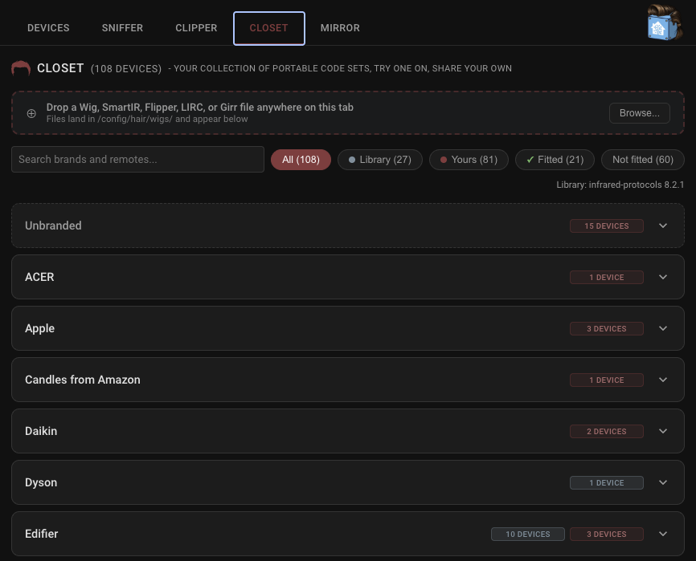

Getting things in is one gesture: drop a file anywhere on the tab (or click Browse). The drop bar reads the file, converts it if needed, and becomes the receipt -- it tells you exactly which brand the arrival hung under, with the name and brand clickable so you can jump straight to it. Dropping a file whose codes are already in the closet still files it, but the receipt turns yellow and lists every place an identical device already hangs. When the arrival is a superseding wig -- one whose ancestry names a wig already on your shelf -- the drop bar offers to replace that ancestor instead of hanging a twin: the old file steps aside, every device that came from it repoints to the successor, and you can top up those devices with the new wig's added buttons in the same step. Choose Keep Both instead and nothing is deleted; the two hang side by side, and your fitting of the old wig stays with the old wig while the successor waits for its own. Five formats convert on drop:

- **Wig files** (`.wig.json`) -- HAIR's own format, filed as-is.
- **SmartIR JSON** -- media player, fan, and climate files, in all four SmartIR encodings (Base64, Hex, Pronto, Raw). Climate files convert into wigs carrying a structured state matrix -- every mode / fan / swing / temperature combination as one complete code -- with the file's flat extras (sleep, LED, one-shot codes) arriving as ordinary buttons alongside. See [Stateful air conditioners](#stateful-air-conditioners) for what that unlocks.
- **Flipper Zero** (`.ir`) -- both raw captures and parsed protocol entries (NEC, Samsung, Sony, RC-5) re-encoded through the code library.
- **LIRC** (`lircd.conf`) -- raw codes and standard space-encoded remotes, reconstructed from the config's timing parameters, one wig per remote block.
- **Girr** (IrScrutinizer's export format) -- learned Pronto carried verbatim, one wig per remote. Since IrScrutinizer imports from IRDB, Pronto CCF, JP1, and more, anything it can open is one export away from your closet.

Anything a conversion has to skip -- an unsupported protocol, a truncated entry -- is written into the wig's notes with a reason, so a partial import is never silent. Every arrival is also combed on the way in, which is a different question from whether its codes work: combing reports codes that disagree with each other, and it is how a defect that survived conversion intact gets noticed before you build a device on it. See [Combing a wig](#combing-a-wig).

To use an entry, click **ADOPT** right on the row: the set becomes a working HAIR device in one dialog, every signal a named command with recognizable names already mapped to entity actions, and a matrix wig becomes a fully-controlled air conditioner (see [Stateful air conditioners](#stateful-air-conditioners)). If you would rather test the codes first, **CLIP** materializes the wig on the Clipper as a working remote, each signal decoded fresh against your install's decoders, ready to test and assign before you adopt from there; clipping the same wig again updates the existing clipped remote instead of minting a duplicate. To share or archive your own work, use **Save to Closet** on the device and pick a route -- save a new wig, update the one it came from, or validate a perfect fit (see [Fitting a wig](#fitting-a-wig)). The wig file carries the name, brand, model, notes, and an origin stamp that records whether the codes came from live capture, hand entry, a pluck, or a conversion. The wig editor also takes product identifiers (FCC ID, UPC, ASIN, verified OEM) and a **kind** ("candles", "soundbar", "tv") so an off-brand device stays findable even when its brand and model mean little; see [The wig format](docs/wig-format.md).

### Stateful air conditioners

An AC remote does not send buttons, it sends states: every press transmits the complete mode / fan / swing / temperature the unit should be in. HAIR handles those devices as what they are. Drop a SmartIR climate file on the closet and it converts into a wig carrying the full state matrix; the closet row counts its states and peeks the shape of the lattice instead of listing hundreds of cell names. Click ADOPT and you get a fully-controlled climate entity: change the temperature on the thermostat card and HAIR looks up that exact state's code and transmits it whole, with swing and temperature controls appearing only when the matrix actually has those dimensions. Temperatures follow your install's unit on every display while the file's native numbers stay untouched underneath.

The device's detail page grows a STATE MATRIX card in cold blue: browse the lattice one branch at a time, see which state the entity last transmitted, send any state directly, or press "+ Command" to save a state you use often as a named command -- it lands in the commands list with a STATE chip and works everywhere a command works, in dashboards and automations included. Attesting a matrix wig through **Validate for Perfect Fit** walks a dimension checklist: 12 to 20 rows covering every mode, fan speed, swing position, and the temperature extremes stand in for the whole lattice, and a fitted matrix wig wears the green check like any other.

A few things the importer will not do. Files from Xiaomi-controller sources whose codes are Raw are refused, because that Raw is a proprietary compressed format rather than timing data. A small share of corpus cells (roughly half a percent) cannot be converted and are skipped, with the reason written into the wig's notes; modes that have no Home Assistant equivalent are skipped the same way. A state the file does not carry stays absent in HAIR, which never invents a code. The dimension check confirms that each dimension works along its own axis, not that every one of several hundred cells was individually fired. And climate files are read as Celsius unless they say otherwise, which is the corpus convention.

### Combing a wig

Combing asks a different question from fitting. A fitting asks whether a code works on your device; combing asks whether a wig's codes agree with each other, which is something HAIR can answer on its own, in a moment, without any hardware at all.

Every code from one remote should look like it came from the same remote: the same number of frames, the same number of pulses in each, and on a state matrix, a temperature row whose codes change as the temperature does. When one code breaks that pattern, something is wrong with it, and the pattern is enough to say so without knowing the protocol. That is why combing works on hardware nobody has written a decoder for, which is most of what arrives in a closet.

This is not a hypothetical problem. Of six real SmartIR climate files examined during development, five carried defects a conversion faithfully preserves: short frames, a cell sending its neighbor's code, gaps in a temperature run, states nothing in the file advertises. None of it is visible reading the file.

Combing runs automatically when a wig is imported, and on demand from the comb on any closet row. The report leads with consequence -- what a finding does to your device: **will do the wrong thing**, **will be ignored**, or **cosmetic** -- and shows the count against the total, because 48 findings reads differently on a 750-cell lattice than on a seven-button remote. Findings that say the same thing are grouped under that sentence once, with their coordinates beneath it. The checks:

- **Duplicated neighbor** -- a cell that sends the code belonging to the state next to it, in a row that changes at every other step. The worst of the five, because the device answers and looks like it worked while setting a state you did not ask for. Nothing about the device's behavior tells you, which is why the comb glows red for this one alone.
- **Malformed frame** -- a code short of the timings every other code here carries. The device does not recognize it and ignores the press, so the control appears dead.
- **Frame shape** -- a code that does not match the shape of the rest of the remote. Often a code that came from somewhere else.
- **Missing state** -- a gap inside a temperature run the file otherwise covers. Home Assistant offers the control and nothing happens.
- **One state, two codes** -- two entries claim the same state. HAIR sends one and the other is unreachable: a dead code rather than a wrong action, reported so someone can decide which is right.
- **Stray burst** -- one extra timing after a code's last frame. It transmits correctly; reported for tidiness.
- **Undeclared state** -- a mode or fan speed present in the codes that nothing in the file advertises. Present and harmless.

An eighth is reported and never counted: the same code appearing under two different names. On a toggle remote that is correct, since one code really is both Power On and Power Off, so it is shown for your information and never treated as a fault.

Combing is deliberately careful about what it will not call a defect. A whole temperature row sending one code is correct, not broken: the device ignores temperature in that combination, and real files do this constantly. Only a row that changes at every step except one is a defect. Ordinary button remotes get a looser check than state matrices, because the protocols they use vary their own length by which button was pressed, and demanding uniformity there would condemn perfectly good codes.

The result is stored on the wig as a receipt with the date, so the closet can show it without re-checking: the row's comb glyph glows yellow when the receipt holds findings, and red for the one class worth interrupting you for. A wig nobody has combed and a wig that combed clean both show a plain grey comb, because absent is not the same as clean; the tooltip tells you which. A receipt describes the codes as they were when it was written, so after repairing a code, comb again to refresh it. The report also ends by saying where the flagged codes actually are: adopt the wig and every one becomes a repairable command row wearing a comb glyph, or jump straight to the device that already carries them.

### Fitting a wig

A wig in your closet is a saved set of codes. A fitting is proof that those codes actually work on real hardware, and that proof travels with the file from here on.

Here's the process: **adopt the wig** onto a device and use it like you normally would. Once you trust it, open the device and click **Save to Closet**. HAIR gives you three options:

- **Save as New** -- files a fresh wig and leaves the original untouched.
- **Update Closet Wig** -- brings the shared file up to date with your device. If the update would retire someone else's fitting, HAIR tells you before you commit.
- **Validate for Perfect Fit** -- this is the actual fitting. It only appears on devices that came from a wig in the first place; a device built from scratch just sees Save.

Perfect Fit opens a checklist, one row per command, every box grey and unchecked to start: the click is the attestation, so nothing is claimed until you make the claim. Hit **TEST** on a row and it reports back SENT, or SENT and HEARD if a receiver caught the transmission, then check the box once you've confirmed it works. Signing only unlocks once every row is checked -- there's no partial save on a flat wig. If your device has picked up or dropped commands since the wig was last saved, a **Changes with new fitting** section shows exactly what's being added or removed before you sign. A code that genuinely doesn't work on your hardware gets fixed or removed on the device itself, then you fit the corrected version; a state-matrix AC's dimension checklist is the one place still offering "not on my device" or "could not make it work" per row, because a lattice can't be edited cell by cell the way a command can.

Signing ties your verdicts to a key generated on your own install rather than to whatever name you type in, so nobody can edit your results or fit in your name later. Fit the same wig again down the line with nothing changed, and your new signature simply replaces your old one.

Fix a code on the device itself, not inside the fitting screen: open the command, paste in a corrected Pronto code or hit **LISTEN** to capture it fresh off the real remote, then save. That's a device change, so run **Update Closet Wig** afterward to push the fix back to the shared file (state-matrix AC wigs are the one exception -- they repair in place and get re-combed automatically). A repaired wig is a different wig, so whatever fitting it had before wasn't really a perfect fit after all -- adding, removing, or fixing a command starts a brand new fitting with only your signature on it, and that one is now the current record until someone else fits the corrected version too. Anything the comb flagged earlier carries its comb glyph right onto the device row, so you can see which commands deserve a second look before you vouch for them.

One habit makes the whole process smoother: go slow. Give the device a beat between presses so you can actually watch it react before marking a row.

Fittings are what make a shared wig trustworthy. The more people who fit one, the more proven and useful it becomes, and only fitted wigs can graduate into generated Home Assistant integrations. If you own hardware for something sitting in your closet, fitting it is one of the best contributions you can make.

### The Mirror Tab

The Mirror logs every IR transmission that originates inside Home Assistant, at the moment it is sent. A HAIR device command, a Test from any catalog tab, an automation firing a command, or another integration sending through the native `infrared` platform: each lands as a row showing what was sent (the assigned command name when there is one, otherwise the decoded protocol identity), which emitter carried it, whether a receiver heard it back and in which room, where it came from, and how many times it has been sent. A send that arrives while you are watching blooms its row silver.

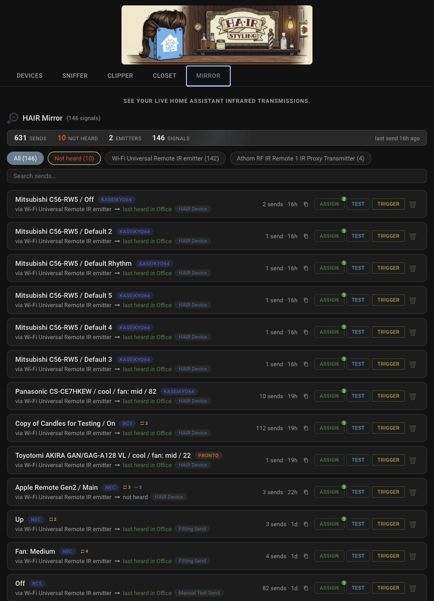

The heard-back column is the part that earns the tab its place: a command that transmits but is never heard by any receiver reads "not heard", which is how you find a dead IR LED, a misaimed blaster, or an offline emitter without pointing a phone camera at anything. "Not heard" is neutral, not an alarm, because plenty of setups are transmit-only on purpose; the amber "Not heard" filter chip is there when you are actually troubleshooting. Homes with no receiver at all simply see their sends without heard-back detail. Filter chips narrow the list to one emitter, and search covers names, protocols, emitters, and origins.

Every row carries the same Assign, Test, and Trigger buttons as the rest of the panel, plus the code viewer. That makes the Mirror the third road for importing codes, next to the Clipper (paste) and the Plucker (pull by name): press a button in any vendor app whose blaster transmits through the infrared platform, and if a receiver hears the transmission, the decoded code appears in the Mirror ready to assign to a HAIR device. No pasting, no vendor support file, no re-learning.

Repeat sends of the same command bump one row's count rather than piling up, and deleting a row just clears the entry -- it returns the next time that signal is sent, so tidying up old experiments never damages the audit. One rule the Mirror never bends: triggers do not fire on anything it records. When Home Assistant sends a command and a receiver hears the echo, that capture is attributed to the send rather than treated as a new signal, so a trigger means "this arrived from the outside world" and can never feed back on the house's own output.

### Adding a Device

There are six ways to add a device.

**From scratch:** Click the "+ Add" button in the tab bar on the Devices tab. Enter a name, pick a device type, and select which IR emitters should broadcast commands for this device. HAIR creates the device profile and the corresponding HA entities immediately.

**From the Sniffer (sniff it from the air):** When HAIR detects a remote it doesn't recognize, it appears in the Sniffer as an unknown source device. Hover over the source row's name and click it to rename it, then click Adopt. Every signal on the remote comes across as a named command (aliases and decoded names carry over), recognizable names are auto-mapped to entity actions, and the new device stays linked to its source remote across the catalog tabs. Renaming before promoting means your new device shows up in the Devices tab already labeled the way you want it, instead of carrying the auto-generated "Unknown Remote N" name forward. You can also rename it later from the Devices tab. This path is ideal when you have the physical remote in hand and want to capture its signals first.

<p align="center">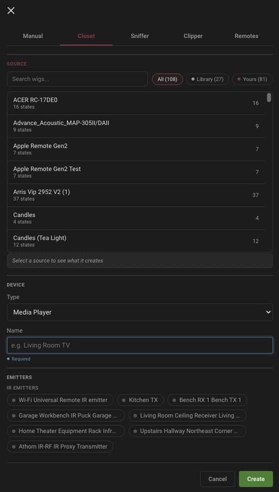</p>

**From the Clipper (paste the codes in):** A remote you build by hand becomes a device the same way a sniffed one does. Paste its signals with "+ Add" and "+ Add Signal", then click Adopt on the remote; every pasted signal arrives as a command. This is the path for a device you have Pronto codes for (from a converter, datasheet, or ESPHome log) but cannot capture live.

**From the Plucker (pull from a vendor blaster):** A blaster you mirror on the Plucker tab becomes a device the same way a sniffed or clipped remote does. Once you have plucked the signals you want with "+ Pluck Signal", click Adopt on the blaster. This is the path when the codes already live in a vendor blaster (such as Tuya Local) and you want them as HA entities without re-learning each one at a receiver.

**From the Closet (start from a code set):** Find your device's brand on the Closet tab -- or drop in a wig, SmartIR, Flipper, LIRC, or Girr file -- and click Adopt right on the row; the device is created with every button named. If you want to test the codes first, click CLIP to land the set on the Clipper as a working remote, confirm a couple of sends really drive your hardware, then adopt from there. This is the path when someone has already done the capturing for you. A SmartIR climate file adopts as a fully-controlled air conditioner; see [Stateful air conditioners](#stateful-air-conditioners).

**From an existing device (duplicate):** Click the duplicate icon in the top-right corner of any device card. HAIR opens a dialog pre-filled with `<original name> (Copy)` so you can rename the clone before it lands. All of the original device's commands, action mappings, and emitter assignments are copied across; triggers stay attached to the original. This path is ideal when you have several remotes of the same model (a stack of similar AC units, two identical TVs in different rooms) or when you want a sandbox copy to experiment with action mappings without breaking the working device.

### Learning Commands

Navigate to the Sniffer tab and press buttons on your physical remote. HAIR captures each signal in real time. Expand the source device row, then click on a signal to assign it to one of your HAIR devices. Pick a command name from the device-type-aware template list (e.g., "Power On," "Volume Up," "Mode: Cool") or enter a custom name. While assigning you can also set a "Send times" count for a device that needs the command repeated to register; you can change it later in the command editor.

<p align="center">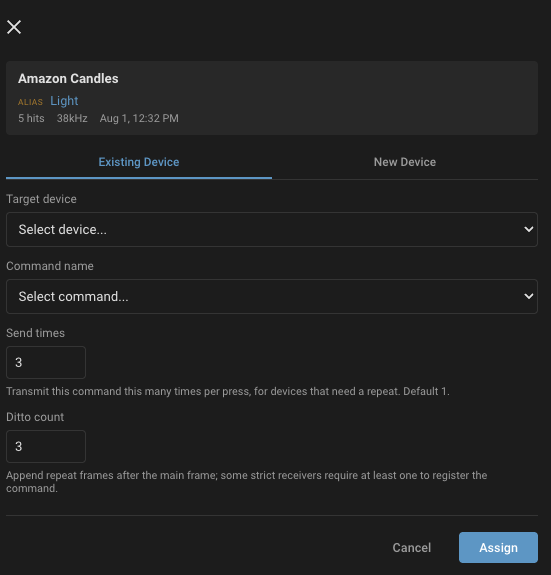</p>

For air conditioners, command names like "Temp 22" and "Temp 24" wire themselves up: each one maps to its temperature step and the climate card grows a real thermostat bounded to your steps, snapping to the nearest one as you drag. Deleting a temp command removes its step.

When you don't have the physical remote to hand, build the command in the Clipper instead: paste the button's Pronto code on the Clipper tab, then Assign it to a device exactly as you would a sniffed signal. Sniffed and clipped signals are interchangeable once captured.

When the code already lives in a vendor blaster (such as Tuya Local), use the Plucker tab to pull it into HAIR by name without re-learning it at a receiver. Register the blaster with "+ Add Blaster", then "+ Pluck Signal" with the command name you used in the vendor's app, and the resulting signal is interchangeable with sniffed and clipped ones for assignment, alias, trigger, and Adopt.

And when the send happens anyway, let the Mirror catch it: press the button in the vendor's own app, and if a receiver hears the blaster fire, the code lands on the Mirror tab with an Assign button on it. See [The Mirror Tab](#the-mirror-tab).

You can also start from a device. A device's detail view has add-command buttons that take you to the appropriate capture surface (Sniffer, Clipper, or Plucker depending on what you have configured) so you can capture, paste, or pluck the signal and assign it back to the device.

### Action Mapping

After learning commands, open a device's detail view and click the "ACTIONS" badge on any command row. A popover shows all available actions for that device type. Pick an action to bind it to that command. For example, mapping "Power On" to the `turn_on` action means the HA media_player's power button will fire that IR command. Actions already mapped to other commands are shown with their current assignment so you can reassign with a single click.

<p align="center">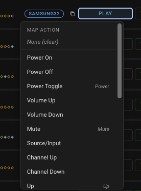</p>

One kind of device never needs this. Adopt a stateful AC wig from the closet and everything is wired into the Home Assistant climate entity automatically: the state matrix drives the entity directly, so there is nothing to map by hand, and the Map action does not appear on those devices.

### Editing signals and commands

Every signal and command has a copy/edit glyph that opens it in a single editor. Use it to read the raw Pronto code, copy it (select the code and press Cmd/Ctrl+C; the panel runs in a context where the browser blocks programmatic clipboard writes on plain http, so the button selects the code for you), or change it. Editing a code re-evaluates it as if freshly captured, so its fingerprint, carrier, and decoded identity update. If a trigger is bound to the signal and your edit shifts its S/L fingerprint, the trigger re-points to the new code automatically and the editor tells you which trigger it moved.

On the Sniffer, when a signal's carrier reads off the common IR standards, the editor shows an amber notice with a "Snap to N kHz" button that re-encodes the Pronto at the nearest standard (30, 33, 36, 38, 40, or 56 kHz). You see the result before you save.

A device command's editor also carries its name and a "Send times" count (how many times to transmit the whole command per press, for a device that needs a repeat). Renaming a command updates any action mappings that pointed at the old name. And it replaces: paste a new Pronto over the old one, or press **LISTEN** and capture it off the real remote -- the heard code lands in the box for you to look at, and nothing commits until you save.

One thing to know about what an edit reaches: a device command is a copy of the signal you assigned from. Editing a stored Sniffer or Clipper signal does not change commands already assigned from it, and editing a command does not change the catalog signal. Edit the command on the device to change what that device transmits.

### Triggers

Triggers let you use incoming IR signals as automation triggers in Home Assistant. There are four ways to create a trigger.

<p align="center">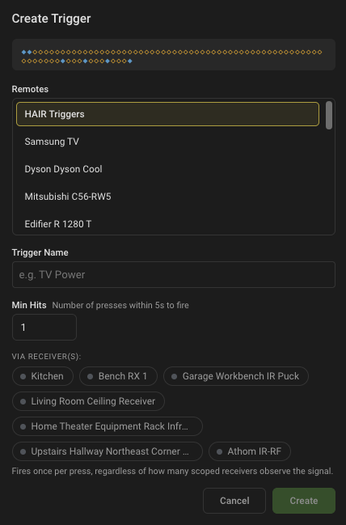&nbsp;&nbsp;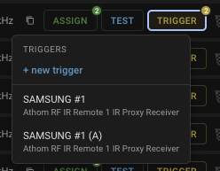</p>

From a device command: expand a device in the Devices tab and click the trigger button on any command row. This creates a trigger linked to that command's signal. If a trigger already exists for that command, the button opens the trigger in edit mode instead.

From the Sniffer: expand an unknown device and click the trigger button on any signal row. This creates a trigger from the raw signal fingerprint, which is useful for signals you want to react to without assigning them to a HAIR device.

From the Clipper: expand a clipped remote and click the trigger button on any signal row, the same as in the Sniffer. This turns a pasted Pronto code into an automation trigger without having to assign it to a device first.

From the Mirror: click the trigger button on any recorded send's row. This is the road for a code another integration transmits -- catch it once on the Mirror, make it a trigger, and the physical remote that sends it drives your automations from then on. The Mirror's own gating still applies: the house's sends never fire it; only the same signal arriving from the outside world does.

Each trigger has a configurable "min hits" value (minimum button presses, 1 to 10) that controls how many times the signal must be received within a 5-second window before the trigger fires. Setting this to 2 or 3 is useful for preventing triggers from firing on stray or accidental presses.

Active triggers appear in the Triggers section at the bottom of the Devices tab. When a trigger fires, its card flashes with an amber glow animation. Each trigger creates an `event` entity (e.g., `event.hair_triggers_tv_power`) that you can use directly in HA's automation editor as a trigger condition.

## Entity Platforms

Devices automatically get native HA entities based on their type:

| Type | HA Entity | Controls |
|------|-----------|----------|
| Media Player | `media_player` | Power, volume, mute, source, channels, navigation, transport |
| AC | `climate` | HVAC modes, temperature presets or a full state matrix, fan modes, swing |
| Fan | `fan` | Power, speed stepping or direct speed levels (1-10), oscillate |
| Light | `light` | On/off, brightness stepping |
| Switch | `switch` | On/off |
| Screen | `cover` | Open, close, stop |
| Other | `remote` | Generic IR command sender |

Every device also gets a `remote` entity for sending arbitrary Pronto hex codes and a `button` entity for each learned command. The button entities give you one-tap access to any IR command from dashboards, automations, or scripts, regardless of device type.

Triggers create `event` entities under a shared "HAIR Triggers" device. Each trigger entity fires an `ir_command_received` event when its signal is detected, making it available as an automation trigger in HA's automation editor.

Entity features are driven by explicit action mappings. A media_player only exposes volume control if you map commands to the volume actions. This keeps your entities clean and avoids exposing features your remote doesn't support.

## ESPHome Setup

If your ESPHome device already has `remote_transmitter` and `remote_receiver` blocks, one addition registers them both on HA's native `infrared` platform, and HAIR discovers them automatically:

```yaml
infrared:
  - platform: ir_rf_proxy
    name: IR Emitter
    id: ir_proxy_tx
    remote_transmitter_id: ir_tx     # your remote_transmitter id
  - platform: ir_rf_proxy
    name: IR Receiver
    id: ir_proxy_rx
    receiver_frequency: 38kHz
    remote_receiver_id: ir_rx        # your remote_receiver id
```

Reflash, and the Devices tab shows the emitter with a `TX-NATIVE` badge and the receiver with `RX-NATIVE`. That's it.

For ready-made, HAIR-tested configurations for common ESP32 boards and IR devices (XIAO Smart IR Mate, Athom RF IR Remote, M5Stack IR Unit, generic ESP32s), see [`esphome/`](esphome/) in this repo. Each device has two tiers: minimal (just the IR pieces) and full (preserves device-specific features like touch pads and status LEDs). Copying one of those is the fastest road to a working setup.

<details>
<summary><b>Starting from scratch? The complete minimal YAML (TX + RX + registration)</b></summary>

```yaml
# --- IR Transmitter (TX) ---
remote_transmitter:
  id: ir_tx
  pin: GPIO9        # your IR LED pin
  carrier_duty_percent: 50%
  non_blocking: true

# --- IR Receiver (RX) ---
remote_receiver:
  id: ir_rx
  pin:
    number: GPIO8   # your IR receiver data pin
    inverted: true
    mode:
      input: true
      pullup: true
  dump: all
  tolerance: 25%
  idle: 10ms

# --- Register both on HA's native infrared platform ---
infrared:
  - platform: ir_rf_proxy
    name: IR Emitter
    id: ir_proxy_tx
    remote_transmitter_id: ir_tx
  - platform: ir_rf_proxy
    name: IR Receiver
    id: ir_proxy_rx
    receiver_frequency: 38kHz
    remote_receiver_id: ir_rx
```

</details>

<details>
<summary>Legacy bridge for HA 2026.4-2026.5 (only if you cannot upgrade)</summary>

Before native `InfraredReceiverEntity` shipped in HA 2026.6, HAIR received signals over an event-bus bridge. If you are stuck on 2026.4 or 2026.5, add this to your ESPHome device's `remote_receiver` block:

```yaml
remote_receiver:
  id: ir_receiver
  pin:
    number: GPIO5   # your IR receiver data pin
    inverted: true
  dump: pronto
  on_pronto:
    then:
      - homeassistant.event:
          event: esphome.remote_received
          data:
            protocol: "PRONTO"
            code: !lambda 'return x.data;'
```

The `on_pronto` trigger catches every IR signal regardless of protocol and fires it as a `homeassistant.event` on the HA bus; the HAIR Sniffer subscribes automatically. The panel shows `RX-BRIDGE` on the receiver card while this path is in use.

When you upgrade to 2026.6+, add the `infrared` platform receiver entry shown above and reflash. HAIR detects the native receiver and switches over automatically. You can keep the bridge in place during the transition, signals are not double-processed and the card shows both badges, then remove the `on_pronto:` block once `RX-NATIVE` appears.

</details>

## How It Works

HAIR sits between you and HA's IR platform. It does not replace your IR hardware integrations (ESPHome, Tuya Local, Broadlink, etc.). It complements them by providing the admin layer those integrations lack.

### Capture (RX)

HAIR uses a dual-path receive architecture. On HA 2026.6 and later, HAIR subscribes to native `InfraredReceiverEntity` instances via `infrared.async_subscribe_receiver()`. This is hardware-agnostic: any integration that exposes a receiver entity on the `infrared` platform works automatically, no per-vendor code in HAIR. Installs still on HA 2026.4-2026.5 can use the legacy ESPHome event-bus bridge instead (the collapsed block in [ESPHome Setup](#esphome-setup)). Both paths feed the same signal-processing pipeline so fingerprinting, deduplication, and trigger matching behave identically regardless of which path is active. The Devices tab surfaces which path each receiver is using via `RX-NATIVE` and `RX-BRIDGE` badges.

### Transmit (TX)

HAIR transmits IR signals via any integration that exposes HA's native `infrared` platform. Currently ESPHome, [Tuya Local](https://github.com/make-all/tuya-local), Broadlink, SMLIGHT, and other integrations that adopted the platform.

### Signal Fingerprinting

Captured IR signals are fingerprinted using S/L (short/long) pulse-duration classification. Each pulse in the signal is classified as short or long, producing a pattern that uniquely identifies the signal regardless of minor timing jitter between presses. In the UI, these patterns are shown as two-tone diamond sequences for quick visual identification.

S/L fingerprinting covers all major consumer IR protocols including NEC, Samsung, JVC, LG, Sony, and RC-5/RC-6. Repeat frames (sent while a button is held) are filtered automatically. Signals are grouped by source device using carrier frequency and preamble analysis, so the Sniffer knows which remote a signal came from without needing to decode the specific protocol.

When HAIR can read a captured signal as a known protocol (NEC today), it also stores the decoded form alongside the raw timings for stronger matching and cleaner transmission. Raw timings remain the source of truth, and transmit can re-encode clean timings from the decoded value instead of replaying the captured ones, which fixes a class of replay failures against destinations that expect undistorted timing.

When a rebuild is the wrong thing -- some devices only answer a capture whose repeats are baked in -- any decoded signal can be pinned to send its bytes verbatim. The protocol pill on a device command, Sniffer row, or Clipper row toggles between the decoded name and BYPASS, and the choice travels: it rides assignment, export, and the wig file itself, so a code somebody repaired arrives working for the next person (see [The wig format](docs/wig-format.md)).

### Architecture

Four signal sources feed one catalog: live capture (Sniffer), manual Pronto paste (Clipper), vendor code import (Plucker), and the send audit (Mirror). The Mirror also closes the loop on the TX side: every outgoing send is logged with its provenance, and echoes of the house's own transmissions are attributed back to their send instead of re-entering the capture pipeline. Alongside the catalog runs the closet road: dropped code files (wigs, SmartIR including climate state matrices, Flipper Zero, LIRC, Girr) convert into wigs through the import funnel, and a closet entry either materializes on the Clipper with CLIP or adopts straight into a device.

```
  Remote Control                              Pasted Pronto hex
        |                                            |
  IR Receiver Hardware                               |
        |                                            |
  +--------------------------+---------------------------+
  | Native (HA 2026.6+)      | Legacy (HA 2026.4-2026.5) |
  | InfraredReceiverEntity   | ESPHome remote_receiver   |
  | async_subscribe_receiver | esphome.remote_received   |
  +--------------------------+---------------------------+
        |                                            |
        |<-- echo attribution: captures matching a pending send
        |    route to the Mirror, never to triggers or the Sniffer
        |                                            |
  HAIR Sniffer (RX capture)   Clipper (paste)   Plucker (vendor pluck)   Mirror (send audit)
        |                          |                      |                    |
        +--------------+-----------+----------+-----------+--------------------+
                              |
   Signal Store  (S/L fingerprint + dedup; tracks sniffed / manual / plucked / echo)
                              |
                  Trigger Manager --> Event Entities (HA automations)
                              |
   HAIR Admin Panel  (Devices + Sniffer + Clipper + Plucker + Closet + Mirror tabs)
                              |
   Assign signal / Adopt remote or wig --> Device Manager --> Entity Factory
                              |
   HA Entities (media_player, climate, fan, light, switch, cover, remote, button)
                              |
   HA infrared Platform (infrared.send_command)  <-- TX path: any platform integration
                              |                       (every send logged on the Mirror)
   IR Emitter Hardware (ESPHome, Tuya Local, Broadlink, SMLIGHT, etc.)


   The closet road, running alongside the capture paths:

   Dropped code files (wig / SmartIR incl. climate state matrices / Flipper Zero .ir / LIRC / Girr)
        |
   Import funnel (convert on drop; anything skipped is receipted in the wig's notes)
        |
   HAIR Closet (codebooks from HA's core infrared code library + wig files in /config/hair/wigs/)
        |
        +-- CLIP --> materializes on the Clipper as a working remote
        |
        +-- ADOPT --> Device Manager (a matrix wig becomes a stateful AC climate entity)
```

## Contributing

See [CONTRIBUTING.md](CONTRIBUTING.md) for guidelines.

## License

MIT. See [LICENSE](LICENSE) for details.
