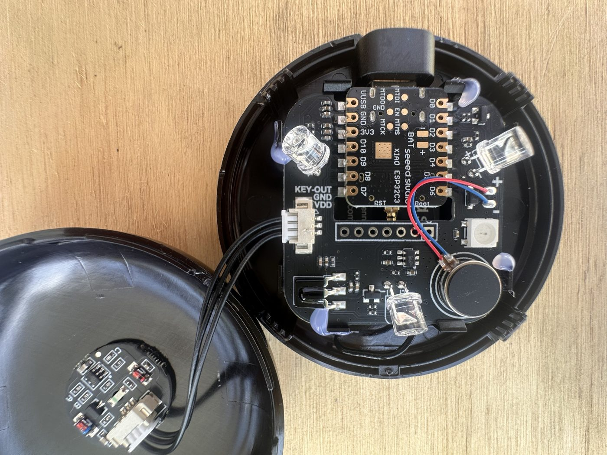
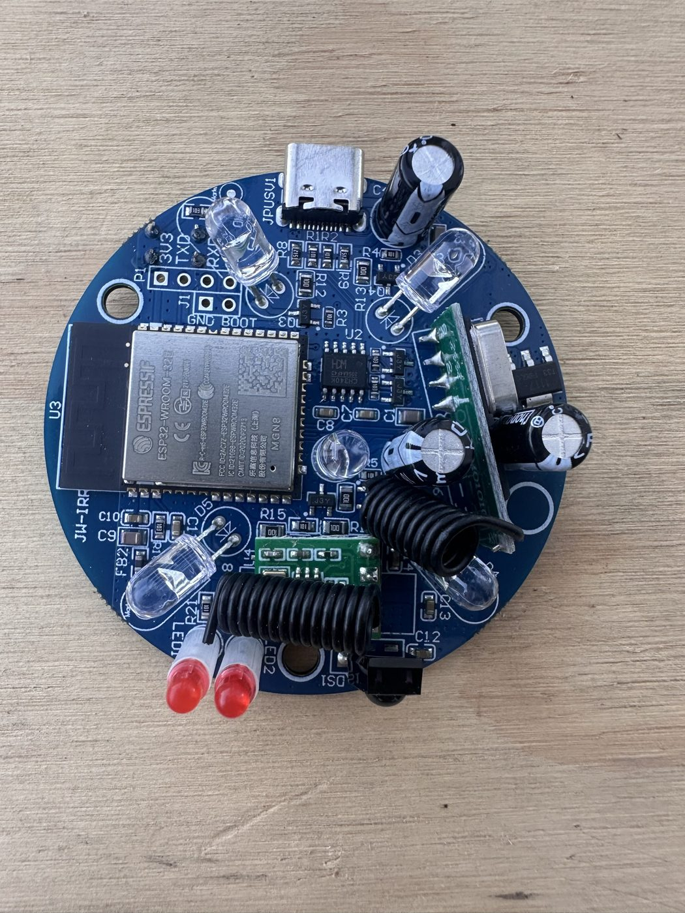
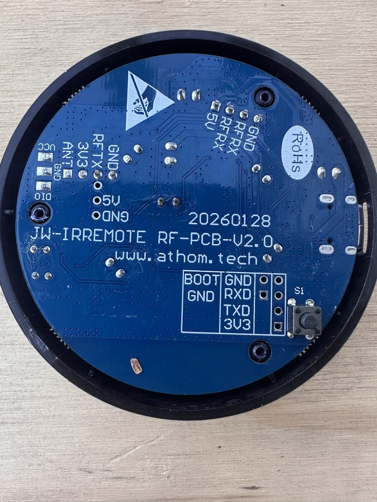
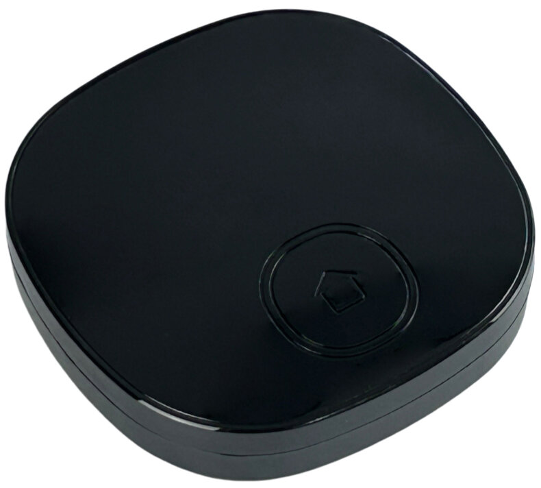
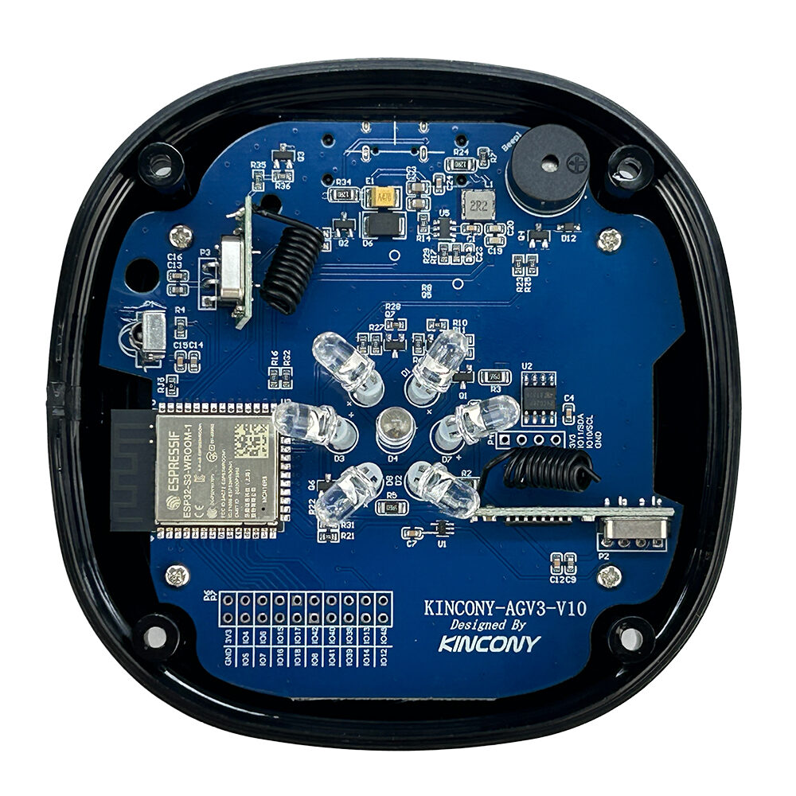
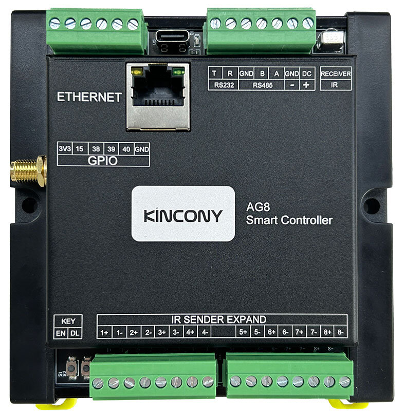
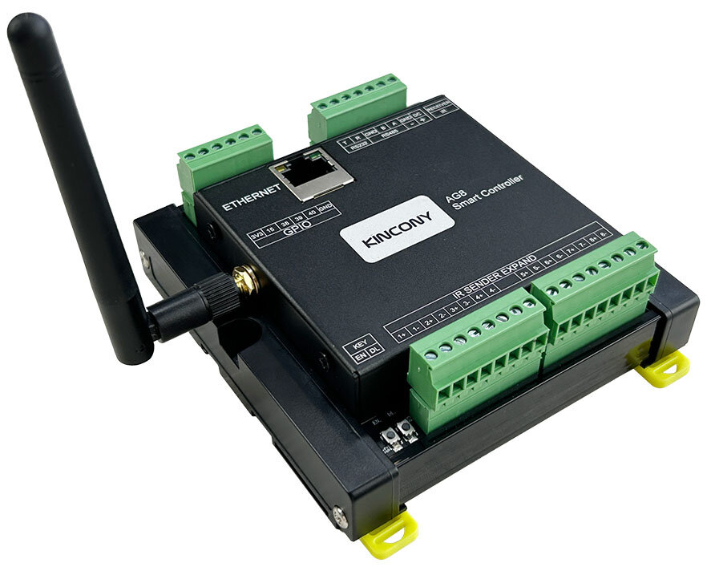

# Recommended IR hardware for HAIR

HAIR does not talk to IR hardware directly. It sits on Home Assistant's native `infrared` platform, so any emitter or receiver that adopts that platform works. The devices below are curated picks we have tested or partnered on, ordered by typical spend and job.

Use this page to choose what to buy. Ready-made ESPHome configs live under [`esphome/`](../esphome/).

## Quick pick

| Tier | Device | Vendor | Best for | Typical price | Buy | HAIR / ESPHome status | Config |
|---|---|---|---|---|---|---|---|
| Low (~$10) | Seeed XIAO Smart IR Mate | Seeed Studio | Single room, DIY / close-proximity puck | $10.90 (10+ $10.50) | [seeedstudio.com](https://www.seeedstudio.com/XIAO-Smart-IR-Mate-p-6492.html?c=qtEeMJf) | Configs in-repo (minimal + full) | [`esphome/xiao-ir-mate/`](../esphome/xiao-ir-mate/) |
| Medium (~$20) | Athom RF·IR Remote (Made for ESPHome) | Athom | Everyday Proxy (TX+RX in one box) | ~$19.50 | [athom.tech](https://www.athom.tech/blank-1/esphome-rf433-ir-remote-controller) | Configs in-repo (minimal + full); Athom's product page links to HAIR | [`esphome/athom-rf-ir-remote/`](../esphome/athom-rf-ir-remote/) |
| High / prosumer | KinCony KC868-AGv3 | KinCony | Power user IR (+ RF hardware on board) | Bundle A $45 / Bundle B $50 | [Marketing](https://www.kincony.com/esp32s3-smart-ir-rf-controller.html) · [Shop](https://shop.kincony.com/products/esp32-s3-smart-ir-rf-controller-kincony-kc868-agv3) | "Works with HAIR" on KinCony's AGv3 page; no in-repo ESPHome config yet | None in-repo (use KinCony or community YAML for now) |
| Multi-zone | KinCony AG8 | KinCony | Restaurants / multi-TV: 8 independent IR sender ports | Bundle A $40 / Bundle B $41 (board + 8 IR tubes) | [Marketing](https://www.kincony.com/esp32-s3-smart-ir-controller.html) · [Shop](https://shop.kincony.com/products/kincony-ag8-esp32-s3-smart-ir-controller) | DIN-rail 8-TX board; ESPHome demo enables 4 TX (see caveat); full 8 independent via KinCony KCS | [ESPHome YAML (forum)](https://www.kincony.com/forum/showthread.php?tid=5889) |

Prices checked from the linked shops around 2026-09-26 and can move.

---

## Low tier: Seeed XIAO Smart IR Mate

**Who it's for.** Someone who wants a finished, no-solder IR Proxy for one room or a desk setup. Close-range DIY tier in the HAIR hardware ladder.

**Form factor.** Housed round puck, about **65 mm diameter × 19 mm tall** (not a bare XIAO board). Matte enclosed shell.

**IR hardware.** 3× high-power IR LEDs for **360°** coverage plus 1× high-sensitivity IR receiver. Also touch pad, vibration motor, status LED, reset. Ships as an ESPHome ready-made project (pre-flashed per Seeed's listing).

*Photo: DAB-LABS. The puck opened: XIAO ESP32C3 on the carrier, three IR LEDs, receiver, vibration motor, RGB LED, and the touch pad lead to the lid.*

**Price / buy.** **$10.90** USD (qty 10+ **$10.50**), in stock when last checked.  
https://www.seeedstudio.com/XIAO-Smart-IR-Mate-p-6492.html?c=qtEeMJf · SKU `109990586` · affiliate/coupon `qtEeMJf`

**HAIR status.** Ready-made configs in-repo: [`esphome/xiao-ir-mate/`](../esphome/xiao-ir-mate/) (minimal + full).

---

## Medium tier: Athom RF·IR Remote (Made for ESPHome)

**Who it's for.** The default "regular user" Proxy: commercial enclosure, IR TX+RX (plus 433 MHz RF on the board; HAIR uses the IR side).

**Form factor.** Compact commercial remote / Proxy enclosure with built-in IR LED, IR receiver, RF, status LED, and button.

*Photo: DAB-LABS. Component side: ESP32-WROOM-32E module, IR LEDs, two red LEDs and the RF coils, USB-C at the top.*

*Photo: DAB-LABS. Back side: the BOOT / GND / RXD / TXD / 3V3 header is where a USB serial adapter goes if you flash it by wire.*

**Price / buy.** Listed around **$19.50** on Athom's product page (other price chips on the page may reflect bundles or options -- confirm at checkout).  
https://www.athom.tech/blank-1/esphome-rf433-ir-remote-controller

**HAIR status.** Athom's product page recommends this integration with a link to `https://github.com/DAB-LABS/HAIR`. Ready-made configs in-repo: [`esphome/athom-rf-ir-remote/`](../esphome/athom-rf-ir-remote/) (minimal + full).

---

## High / prosumer tier: KinCony KC868-AGv3

**Who it's for.** Power users who want a KinCony IR Controller with ESPHome / Home Assistant paths and optional RF hardware.

**Form factor.** KinCony KC868-series controller board (see product photos on the marketing page); not the same SKU as the AG8 DIN 8-port board below.

*Photo: KinCony, from the product page (https://www.kincony.com/esp32s3-smart-ir-rf-controller.html).*

*Photo: KinCony, from the product page (https://www.kincony.com/esp32s3-smart-ir-rf-controller.html).*

**Price / buy.** Shop bundles (when last checked): **Bundle A $45** (AGv3 + USB-C cable), **Bundle B $50** (AGv3 + USB-C + two IR cables).  
Marketing: https://www.kincony.com/esp32s3-smart-ir-rf-controller.html  
Shop: https://shop.kincony.com/products/esp32-s3-smart-ir-rf-controller-kincony-kc868-agv3

**HAIR status.** KinCony's AGv3 marketing page carries **"Works with HAIR"** plus the GitHub URL. No `esphome/kc868-agv3/` config in this repo yet -- use KinCony's published ESPHome / KCS docs until a HAIR-tested config lands.

A board without an in-repo config still needs the receiver values from [Receiver timing](receiver-timing.md) (`clock_resolution: 400000` with `idle: 80ms`); a KinCony ESP32-S3 user ran into the `idle` ceiling this week.

---

## Multi-zone: KinCony AG8 (8-channel IR sender)

**Who it's for.** Multi-TV / multi-zone installs (bars, restaurants, whole-home emitter plants) where each zone needs its own IR lead.

**Form factor.** **DIN-rail** PCB, about **83×100 mm**, removable screw terminals. Industrial board, not a consumer puck.

*Photo: KinCony, from the product page (https://www.kincony.com/esp32-s3-smart-ir-controller.html).*

*Photo: KinCony, from the product page (https://www.kincony.com/esp32-s3-smart-ir-controller.html).*

**I/O (from KinCony).**

- Power: **DC 9-24 V**
- **8× IR sender** terminals (extend with IR tubes / cable; KinCony shows shielded wire and CAT5 extension, long runs claimed)
- **1× IR receiver**
- **Ethernet** (W5500) and **Wi-Fi**
- RS485, RS232, free GPIOs

**Price / buy.** **Bundle A $40** (AG8 board), **Bundle B $41** (AG8 + 8 IR tubes).  
Marketing: https://www.kincony.com/esp32-s3-smart-ir-controller.html  
Shop: https://shop.kincony.com/products/kincony-ag8-esp32-s3-smart-ir-controller

### Hookup (physical)

1. Mount on DIN rail.
2. Wire **9-24 V DC** to the power terminals.
3. Plug each **IR emitter tube** into one of the eight sender terminals; aim each tube at that zone's gear. (Bundle B includes eight tubes.)
4. Network: Ethernet to the LAN, and/or Wi-Fi once configured.

### Firmware / Home Assistant

Two supported paths:

**KinCony KCS v3 (all 8 ports independent).** Flash the KCS BIN with Espressif's `flash_download_tool` over USB (ESP32-S3, USB load mode). Join Ethernet or the open Wi-Fi AP, open the web UI (`admin` / `admin` by default per KinCony's KCS guide), learn/send IR with **TX channel** = tube 1-8. MQTT auto-discovery into Home Assistant.  
Guide: https://www.kincony.com/how-to-use-kcsv3-firmware-esp32-board.html

**ESPHome (HA native `infrared` / HAIR-friendly).** Use KinCony's demo YAML: https://www.kincony.com/forum/showthread.php?tid=5889 · Pin map: https://www.kincony.com/forum/showthread.php?tid=5888

| Function | GPIO |
|---|---|
| IR RX | IO48 |
| IR TX1 to TX8 | IO9, IO10, IO11, IO12, IO13, IO14, IO21, IO47 |

The published ESPHome demo **enables transmitters 1-4** and leaves 5-8 commented out.

**Caveat: 4 vs 8 under ESPHome.** KinCony states that on ESP32-S3 with ESPHome's `remote_transmitter`, **four IR senders work at the same time**, and points at the ESPHome remote transmitter docs. With **KCS v3**, they state you can use **all eight** IR senders independently. For restaurant-style "each TV its own port" under ESPHome alone, plan on the four-TX limit (or sequential/zoned design) unless/until a HAIR-tested config documents a safe eight-TX approach. Prefer **KCS** when you need eight independent zones today.

Schematic: https://www.kincony.com/download/AG8-schematic.pdf

No `esphome/kincony-ag8/` folder in this repo yet. A board without an in-repo config still needs the receiver values from [Receiver timing](receiver-timing.md) (`clock_resolution: 400000` with `idle: 80ms`); a KinCony ESP32-S3 user ran into the `idle` ceiling this week.

---

## Also works (generics / other platforms)

These are not partnership SKUs, but HAIR will drive them once they expose HA's `infrared` platform (or a pluckable blaster path):

| Path | Notes |
|---|---|
| Generic ESP32 + IR LED / receiver | DIY wiring: [`esphome/generic-esp32-c3/`](../esphome/generic-esp32-c3/), [`esphome/generic-esp32-doit/`](../esphome/generic-esp32-doit/) |
| M5Stack IR Unit | In-repo config: [`esphome/m5stack-ir-unit/`](../esphome/m5stack-ir-unit/) |
| Broadlink RM series | Core Broadlink integration; **pluck** only codes already learned into HA (`remote.learn_command`), not Broadlink-app cloud codes |
| Tuya Local IR blasters | TX + **pluck** where supported |
| SMLIGHT Ultima | Native RX since HA 2026.7 (see main README requirements table) |
| MQTT IR hubs | TX/RX since HA 2026.8; many only listen inside a short learn window |

Upstream flash ideas (not HAIR-maintained): [esphome/infrared-proxies](https://github.com/esphome/infrared-proxies), [Seeed-Studio/xiao-esphome-projects](https://github.com/Seeed-Studio/xiao-esphome-projects).

---

## Sources (public)

- Seeed XIAO Smart IR Mate product page (price, dimensions, 3× IR LED + receiver): https://www.seeedstudio.com/XIAO-Smart-IR-Mate-p-6492.html?c=qtEeMJf
- Athom RF433 IR Remote Controller product page: https://www.athom.tech/blank-1/esphome-rf433-ir-remote-controller
- KinCony KC868-AGv3 marketing + shop bundles: https://www.kincony.com/esp32s3-smart-ir-rf-controller.html · https://shop.kincony.com/products/esp32-s3-smart-ir-rf-controller-kincony-kc868-agv3
- KinCony AG8 marketing + shop + pin/YAML/KCS links: https://www.kincony.com/esp32-s3-smart-ir-controller.html · https://shop.kincony.com/products/kincony-ag8-esp32-s3-smart-ir-controller · forum tids 5888 / 5889 · https://www.kincony.com/how-to-use-kcsv3-firmware-esp32-board.html
- ESPHome `remote_transmitter` (RMT-backed TX on ESP32 variants): https://esphome.io/components/remote_transmitter/
- In-repo config index: [`esphome/README.md`](../esphome/README.md)
- Receiver settings for any ESP32 board: [`receiver-timing.md`](receiver-timing.md)
